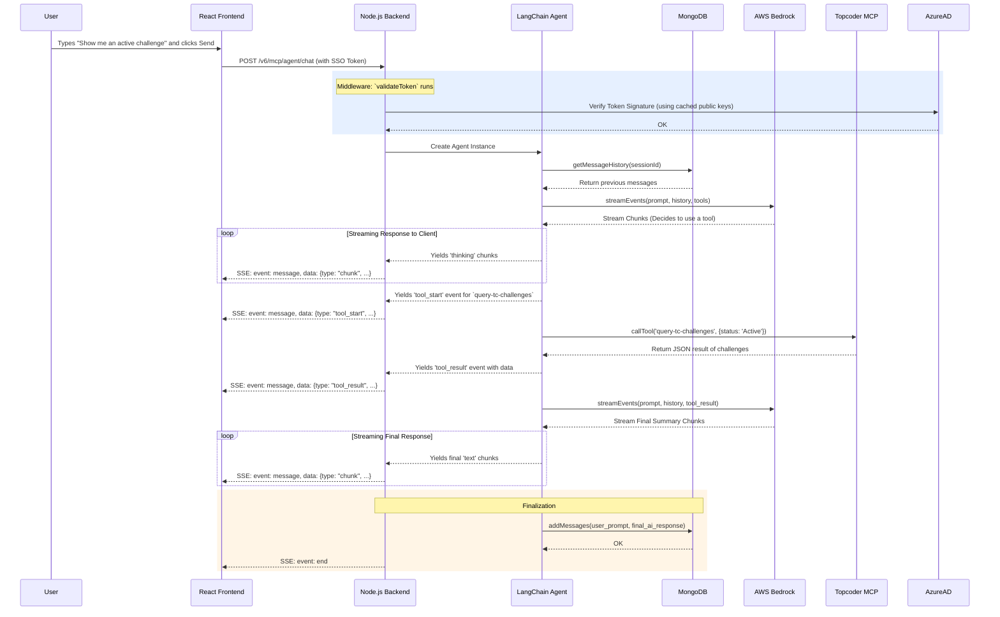

## Teams AI Agent: System Architecture

This diagram illustrates the high-level components of the application and their relationships. It shows how our services, hosted on Azure, interact with each other and with external services to deliver the full functionality to a user within Microsoft Teams.

### Architectural Summary

1.  **Client-Side:** The user interacts with the React application, which is served as a Tab inside the Microsoft Teams client. The frontend's primary responsibilities are rendering the UI, managing client-side state, and initiating authenticated API calls.
2.  **Authentication:** Azure Active Directory is the identity provider. The frontend uses the Teams JS SDK to get an SSO token, which is sent with every API request. The backend validates this token on every call to ensure the request is secure and authorized.
3.  **Backend:** The Node.js application, hosted on Azure App Service, is the core of the system.
    *   It securely loads all its secrets (API keys, connection strings) from **Azure Key Vault** using a passwordless **Managed Identity**.
    *   It exposes a single primary API endpoint (`/v6/mcp/agent/chat`) that uses Server-Sent Events (SSE) for real-time communication.
    *   It instantiates a **LangChain Agent** to handle the conversational logic.
4.  **AI & Tools:** The LangChain Agent orchestrates calls to external services. It sends the user's prompt and conversation history to **AWS Bedrock** for processing and calls the **Topcoder MCP Gateway** when the AI model decides a tool is needed to answer a question.
5.  **Data Persistence:** All conversation history is stored in MongoDB API, providing a scalable and durable memory for the agent.

### Sequence Diagram: A Single Chat Message with a Tool Call

This diagram illustrates the step-by-step flow of data and method calls for a "happy path" scenario where a user sends a message, the agent decides to use a tool, and then responds with a summary.

### Sequence Summary

1.  **Request & Auth:** The user sends a prompt. The frontend sends it to the backend API along with the SSO token, which is validated.
2.  **Memory Retrieval:** The LangChain agent is created and immediately fetches the conversation history from Cosmos DB to provide context for the LLM.
3.  **First LLM Call:** The agent sends the full context to AWS Bedrock. Bedrock analyzes the request and decides that it needs to use the `query-tc-challenges` tool. It streams back its initial thoughts and this tool-use instruction.
4.  **Tool Execution:** The backend streams the "thinking" and "tool_start" status to the frontend. It then makes a direct API call to the Topcoder MCP Gateway.
5.  **Second LLM Call:** Once the tool result is received, the agent sends this new information back to AWS Bedrock, asking it to synthesize a final, human-readable answer.
6.  **Final Response:** Bedrock streams the final summary. The backend relays these text chunks to the frontend, which displays them to the user.
7.  **Finalization:** Once the stream is complete, the agent's memory manager saves the new user message and the final AI response back to Mongo DB for future conversations. The SSE connection is then closed.
